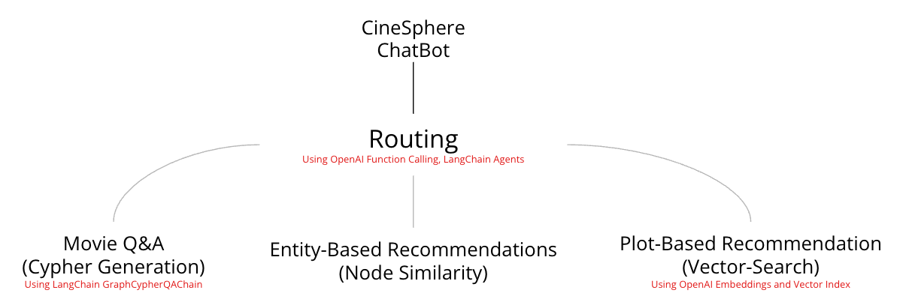

<div style="text-align:center;">
    
</div>

# CineSphere
Movie recommendations using Knowledge Graphs and LLMs

> [Codelabs Documentation](https://codelabs-preview.appspot.com/?file_id=1KAzKlqQ-GWZW9tSMoI07RWoFs0BkJ88tIaO6z5QGpnY#8)<br>
> [Demo Video](https://youtu.be/cTaHir9VKwo)

## Introduction 


CineSphere is your one-stop shot at helping you narrow down your entertainment needs. The crux of our product is the ability to provide 
users with the best of world cinema while also catering to their every query surrounding their favorite celebrities. Some of the features available on the 
product are. 

- Interactive User Interface and experience
- Personalised movie recommendations based on user preferences
- Q&A bot to cater to user queries
- Immediate movie suggestions tailored to user moods
- Wide variety of world cinema

## Architecture Diagram


## Chatbot Functionality



## Implementation

1. Recommendation - CineSphere uses the Node Similarity which is available through Neo4j's Graph Data Science plugin. Users will be allowed to sign up and produce
a set of movies. Upon selecting the movies the graph will capture all relationships and start running a similarity algorithm. The more the user interacts with the recommendation
the better results they will be able to get. 

2. Similarity - The number of questions that might pop up while watching a movie like information regarding the cast or having a debate about an actor's movie. Well, we got you covered. The product leverages the similarity between the various movie nodes and the interaction of the genres, users, actors and crew members around the movie nodes. The app does this on the fly and can be accessed through the chatbot. For this functionality, CineSphere uses Neo4j's graph data science.

3. Q&A - The application also facilitates questions on top of the dataset where it will provide information about the movies like "Give me all the top-grossing movies of an actor" or "How much did a particular movie make in the box office?". This is done with the help of LangChain and OpenAI to launch a GraphQAChain. 

All the 3 main features are compiled to form a multi-agent tool. This multi-agent tool helps route the questions to the appropriate function and helps handle a variety of questions.
  

**Steps to Reproduce**

1) Clone the repo 
2) Create .env file with the following variables - 

```
NEO4J_URI = ''
NEO4J_USER = ''
NEO4J_PASSWORD = ''
OPENAI_API_KEY=''
MOVIE_API_KEY=''
MOVIE_API_TOKEN=''
```
